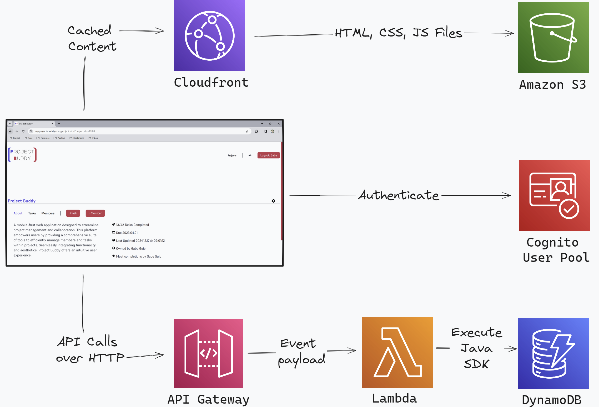

# Project Buddy

## Overview

A mobile-first web application built on serverless technology to streamline project management and team collaboration. This application empowers users by providing tools to efficiently manage tasks and members within projects. Project Buddy offers an intuitive user experience across all devices.

## Architecture Diagram

_Image 1: High-level diagram of Project Buddy's AWS architecture_

Project Buddy is built with a client-serverless architecture utilizing cloud services provided by AWS.

- The presentation layer was programmed using vanilla JavaScript, HTML, and CSS, stored in Amazon S3 buckets. Buckets are cached and deployed by AWS CloudFront.
- User authentication provided by Amazon Cognito.
- The middleware contains RESTful APIs built with Amazon API Gateway, AWS Lambda, and AWS Java SDK.
- The database was provided by AWS DynamoDB with NoSQL structure.

## Technologies Used

### Front-end

- JavaScript, HTML, CSS
- Webpack
- Axios
- Amazon S3
- AWS Cloudfront
- AWS Cognito
- Json

### Back-end

- Java
- AWS DynamoDB
- AWS Lambda
- Gradle
- Dagger

### Testing and Logging

- JUnit
- Mockito
- Log4J
- AWS Cloudwatch

### Version Control and Diagramming

- Git, Github
- PlantUML

### DevOps

- AWS Cloudformation
- AWS IAM
- AWS SAM
- Docker
- Github Actions
- YAML

## Setup (WSL2/Linux OS)

Environment should be hosted on Linux or WSL configured for Windows.

### Prerequisites

Before you begin setting up and running this project, ensure you have the following prerequisites are in place:

- **AWS Account**: You'll need an active AWS account to deploy and manage resources on the AWS platform. [Sign up for AWS](https://aws.amazon.com/free/)
- **Docker**: Containerization platform. [Download Docker Desktop](https://www.docker.com/products/docker-desktop)
- **AWS SAM (Serverless Application Model)**: Framework for building serverless applications. [Installation Guide](https://docs.aws.amazon.com/serverless-application-model/latest/developerguide/serverless-sam-cli-install.html)
- **NPM (Node Package Manager)**: Package manager for JavaScript and Node.js. [Download Node.js and npm](https://nodejs.org/en/download/)
- **Gradle**: Build automation tool for Java projects. [Gradle Installation](https://gradle.org/install/)
- **AWS CLI (Command Line Interface)**: Command-line tool for interacting with AWS services. [AWS CLI Installation](https://docs.aws.amazon.com/cli/latest/userguide/cli-chap-install.html)
- **Amazon Corretto JDK 11**: Distribution of the Open Java Development Kit (OpenJDK) with long-term support from Amazon. [Download Amazon Corretto JDK 11](https://docs.aws.amazon.com/corretto/latest/corretto-11-ug/downloads-list.html)

Ensure you have all the prerequisites installed and set up correctly before proceeding with the setup and deployment of your project.

### Deployments

All deployments require an AWS account and IAM user to provision cloud services.
If you do now have an AWS account or a configured IAM user, please visit [Creating AWS Account and IAM User](resources/readme-setup-instructions/CREATING-AWS-ACCOUNT-AND-IAM-USER.md)

**Developer Deployments**

- [Deployment 1: Local Backend and Local Frontend](resources/readme-setup-instructions/DEV-DEPLOYMENT-1-LOCAL-BACKEND-AND-LOCAL-FRONTEND.md)
- [Deployment 2: Remote Backend and Local Frontend](resources/readme-setup-instructions/DEV-DEPLOYMENT-2-REMOTE-BACKEND-AND-LOCAL-FRONTEND.md)

**Production Deployments**

- [Deployment 3: Manual AWS Setup, Remote Backend and Remote Frontend](resources/readme-setup-instructions/PROD-DEPLOYMENT-3-MANUAL.md)
- [Deployment 4: CICD Setup With GitHub Actions and AWS, Remote Backend and Remote Frontend](resources/readme-setup-instructions/PROD-DEPLOYMENT-4-CICD.md)

## Usage

Intended use-cases coming soon ...

## Testing

Testing methodologies coming soon ...

## API Documentation

API Documentation coming soon ...

## Monitoring and Logging

Cloudwatch metrics and logging details coming soon ...