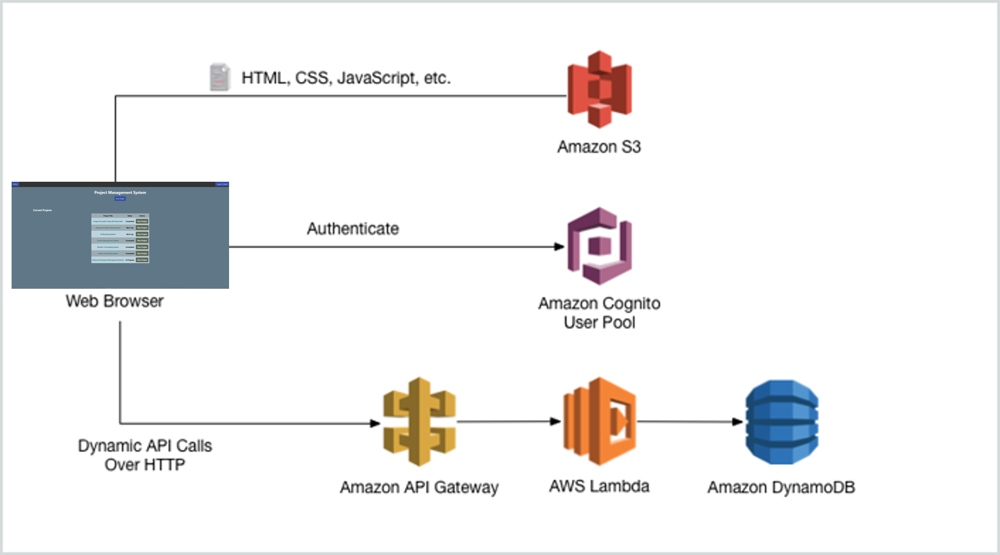
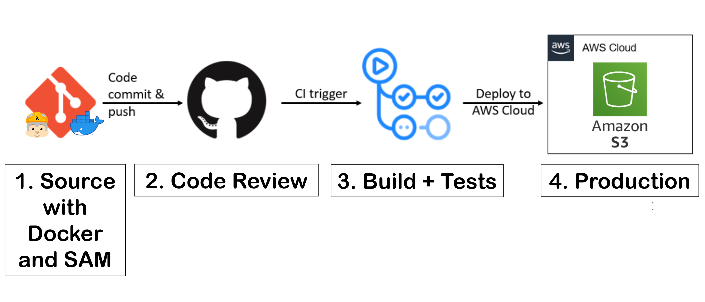
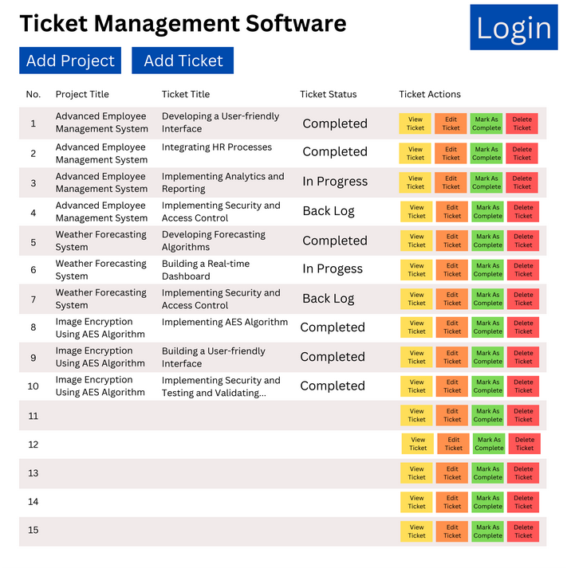
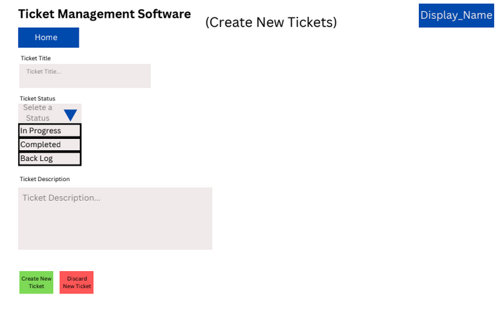
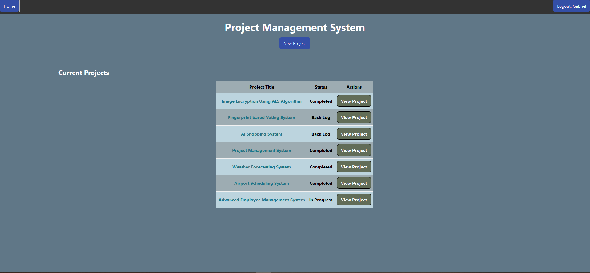
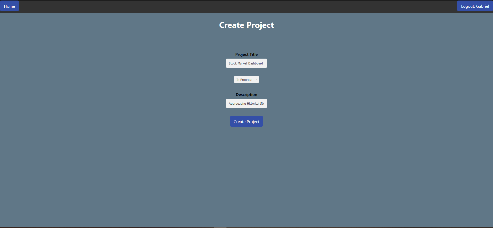
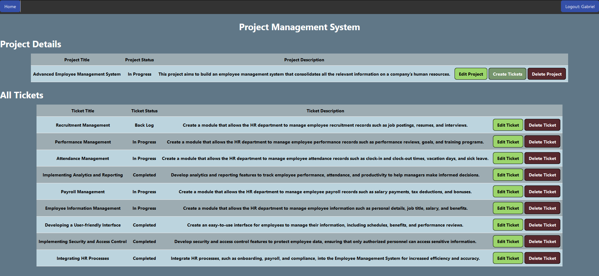
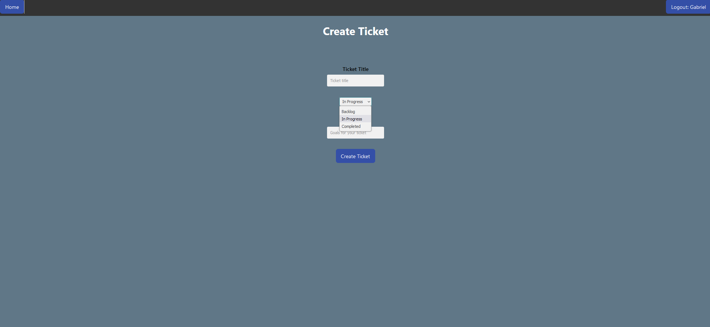
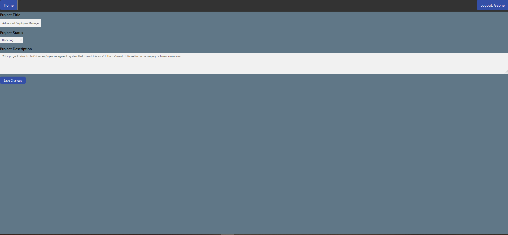
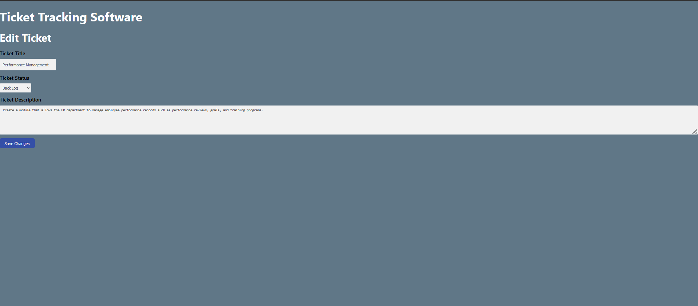

# Project Management System V2

## Overview

This project was a culmination of group work over two weeks to produce an MVP for a Project Management System. Our team was given three days of concept and endpoint design time followed by 10 days of build time, and one day of presentation preparation to accomplish the deliverables and have a functional cloud API architecture paired with a front-end web application.

## Tech Stack

- Backend: Java, AWS Cloudfront, Cognito, Cloudformation, Lambda, DynamoDB
- Frontend: JavaScript, HTML, CSS, WebPack, Node Package Manager
- CI/CD tools: AWS SAM, Docker, Git, GitHub, GitHub Actions, S3

## Project **Infrastructure**

*Image 1: Architecture diagram for the Project Management System*

The MVP was built with a server-client architecture utilizing cloud services provided by AWS. 

- User authentication/flow provided by Amazon Cognito.
- The presentation layer was programmed using vanilla JavaScript, HTML, and CSS, stored in Amazon S3 buckets. Buckets were deployed using AWS CloudFront.
- The middleware contains 10 RESTful APIs built with Amazon API Gateway and AWS Lambda.
- The database was provided by AWS DynamoDB with NoSQL structure.

## CI/CD Tools and Infrastructure

*Image 2: CI/CD for the Project Management System*

The deployment pipeline supported several developer environments for project development, static code analysis, automated build runs, and automated testing.

1. After task assignment, SAM and Docker supported scalable local/cloud deployment environments for building, testing, and developing.
2. Code was pushed using Git. GitHub hosted our remote repository for version control and managing code reviews. 
3. When branches were pushed to production, the CI was triggered for GitHub Actions automating building and testing for production.
4. Upon success, GitHub Actions would deploy our code to the respective Amazon S3 buckets.

# **Project Organization and Execution**

Our concept was to create a productivity tool for small operation teams. Users would make and view all projects in the database, create and manage projects, tickets to a project, update ticket status, and delete either an entire project or a single ticket. ***Project Management System*** was a tool that built upon itself, keeping its developers organized and productive halfway through production.

## Planning and Personal Contributions

- I was tasked with creating front-end wireframes in [Canva](https://www.canva.com/) to outline the presentation layer and page interactivity. This proved useful for keeping us on task for the final installments of the presentation layer. A pdf containing all my contributions to the wireframes can be found here: [Project Management System's Wire Frames](https://drive.google.com/file/d/1WnZCehG-WkQJKHQcwqnskBvUF65jA_UB/view?usp=sharing).
- I led the final design efforts for the [API architecture](https://github.com/GabeGoesCoding/project-management-system/blob/main/resources/design-document.md#5-api), [Entity Relational Diagram Tables](https://github.com/GabeGoesCoding/project-management-system/blob/main/resources/design-document.md#6-tables), and [User Stories](https://github.com/GabeGoesCoding/project-management-system/blob/main/resources/design-document.md#2-use-cases).
- I provided all sample data for testing and the final presentation which can be found [here](https://github.com/GabeGoesCoding/project-management-system/blob/main/data/ticketdata.json).

*Image 3: Wireframe for landing page for Project Management System*

*Image 4: Wireframe for creating a single ticket for Project Management System*

## Results

This project proved as a challenging experience for our group with invaluable lessons learned. We completed 9/10 use cases outlined by our project requirements.

**Use cases we successfully implemented…**

1. Create a project with a title, description, and status to begin adding tickets.
2. Get a project to view the project’s title, description, or status for a brief overview.
3. Update a project by title, description, and status to support continuous development.
4. Create a ticket for a particular project with a title, description, and status.
5. Get a ticket’s information for an overview of the ticket’s work before the ticket assignment.
6. Delete a ticket from a particular project to permanently remove that ticket from the project.
7. Update a ticket’s title, description, and status to support new changes.
8. Get a list of projects in the system for easy navigation for all systems in the project.
9. Get a list of tickets for a particular project to overview the work that’s backlogged, in progress, or completed.

**Use cases we failed to implement…**

1. Delete a project that is no longer needed or created by mistake.

## Retrospective - Lessons Learned

1. Pushing partially completed tickets to production hurts version control and creates problems for integration and other in-progress tickets.
2. Creating new tickets in the middle of a sprint with poor descriptors creates confusion.
3. Upfront planning and discussing specific implementations to avoid ambiguity and poor design help minimize tech debt.
4. Finding balance and the adequate amount of time for preplanning, diagramming, and design. We spent an extra day planning which may have served us better for time spent building.
5. Over-compartmentalizing about prior knowledge and avoiding new growth. It was stressful to learn JavaScript/HTML/CSS as a beginner, but we found that jumping right in and not hesitating was the best approach.
6. During stand-ups, reporting on the work you have done and plan to do helps raise morale and builds trust. Some days we skipped stand-up which may have sparked poor productivity and communication for that day.

## Final Pictures

The project was demonstrated in front of prospecting employers and NSS classmates on Friday, May 05, 2023.

### View All Projects (Landing Page)

### Create Project

### View All tickets For A Project

### Create Ticket

### Edit Project Details

### Edit Ticket Details

